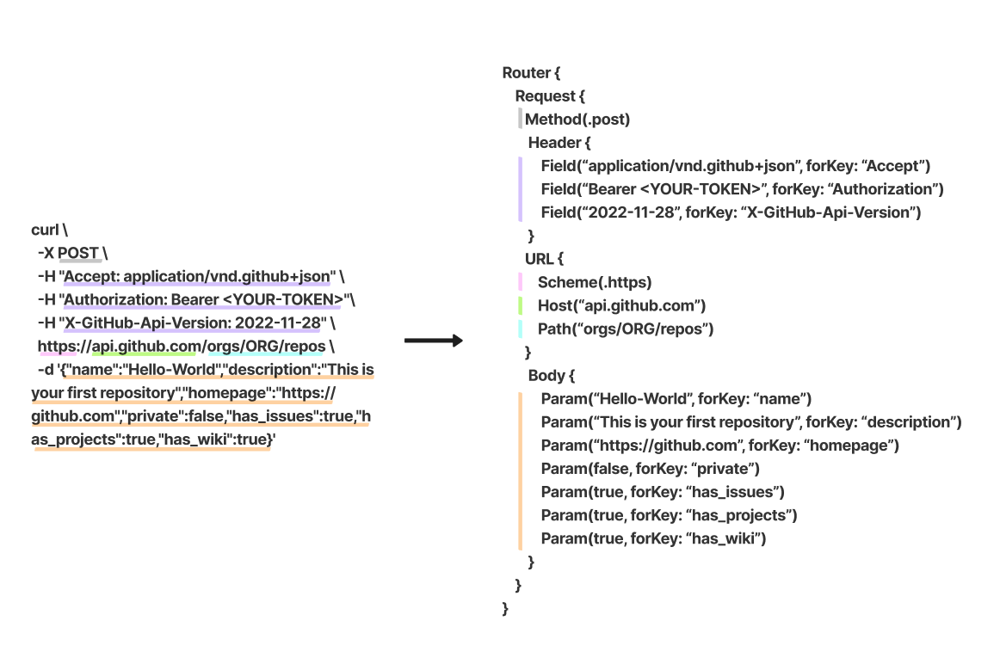

[](https://swiftpackageindex.com/devyhan/apirouter)
[](https://swiftpackageindex.com/devyhan/apirouter)


[](https://codecov.io/gh/devyhan/APIRouter)
[](https://github.com/devyhan/APIRouter/blob/main/LICENSE)

[](https://twitter.com/devyhan93)

<p align="center">
  
</p>

## What's APIRouter 📟
***APIRouter*** is provides an easy way to manage multiple RESTful API endpoints in Swift.
It provides a simple interface for managing multiple endpoints and allows developers to interact with them in a single, unified manner.
It also provides a way for developers to create custom endpoints DSL(Domain-Specific Languages) and to manage their own settings for each endpoint.
Additionally, it provides a way to track the status of each endpoint and to easily detect any changes or updates that have been made.

Similar to Swift Evolution's [Regex builder DSL](https://github.com/apple/swift-evolution/blob/main/proposals/0351-regex-builder.md), URL string literal and a more powerful pattern result builder to help make Swift URL string processing fast and easy and without mistakes. Ultimately, with ***APIRouter***, changes are easy to detect and useful for maintenance.
## Configure APIRouter 📝
### Implement APIs Namespace 
- To implement APIs namespace we create a new type that will house the domain and behavior of the APIs by conforming to `RouterProtocol`.
```swift
import APIRouter

public enum APIs: RouterProtocol {
  ...
}
```
### HttpHeader declaration
- Using `HeaderBuilder` to `httpHeader` declaration.
```swift
Request {
  ...
  Header {
    Field("HEADERVALUE", forKey: "HEADERKEY")
    Field("HEADERVALUE1", forKey: "HEADERKEY1")
    Field("HEADERVALUE2", forKey: "HEADERKEY2")
    ...
  }
  ...
}
```
- Using `Dictionary` to `httpHeader` declaration.
```swift
Request {
  ...
  Header([
    "HEADERKEY": "HEADERVALUE",
    "HEADERKEY1": "HEADERVALUE1",
    "HEADERKEY2": "HEADERVALUE2",
    ...
  ])
  ...
}
```
---
### HttpBody declaration
- Using `HeaderBuilder` to `httpHeader` declaration.
```swift
Request {
  ...
  Body {
    Param("VALUE", forKey: "KEY")
    Param("VALUE1", forKey: "KEY1")
    Param("VALUE2", forKey: "KEY2")
    ...
  }
  ...
}
```
- Using `Dictionary` to `httpHeader` declaration.
```swift
Request {
  ...
  Body([
    "KEY": "VALUE",
    "KEY1": "VALUE1",
    "KEY2": "VALUE2",
    ...
  ])
  ...
}
```
---
### HttpMethod declaration
- Using `Method(_ method:)` to `httpMethod` declaration.
```swift
Request {
  ...
  Method(.get)
  ...
}
```
---
### URL declaration
- Using `URL(_ url:)` to `URL` declaration.
```swift 
Request {
  ...
  URL("https://www.baseurl.com/comments?postId=1")
  ...
}
```
- Using `URLBuilder`  to `URL` declaration and `URLComponents` declaration.
```swift
Request {
  ...
  URL {
    Scheme(.https)
    Host("www.baseurl.com")
    Path("comments")
    Query("postId", value: "1")
  }
  ...
}
// https://www.baseurl.com/comments?postId=1
```
- Using `BaseURL(_ url:)` for `URL` override.
```swift
Request {
  BaseURL("https://www.baseurl.com")
  URL {
    Path("comments")
    Query("postId", value: "1")
  }
}
// https://www.baseurl.com/comments?postId=1

Router {
  BaseURL("https://www.baseurl.com")
  Request {
    URL {
      Scheme(.https)
      Host("www.overrideurl.com")
      Path("comments")
      Query("postId", value: "1")
    }
  }
}
// https://www.overrideurl.com/comments?postId=1
```
---
### How to configure and use ***APIRouter*** in a real project?
- Just create APIRouter.swift in your project! Happy hacking! 😁
```swift
import APIRouter

enum APIs: RouterProtocol {
  // DOC: https://docs.github.com/ko/rest/repos/repos?apiVersion=2022-11-28#list-organization-repositories
  case listOrganizationRepositories(organizationName: String)
  // DOC: https://docs.github.com/ko/rest/repos/repos?apiVersion=2022-11-28#create-an-organization-repository
  case createAnOrganizationRepository(organizationName: String, repositoryInfo: RepositoryInfo)
  // DOC: https://docs.github.com/ko/rest/search?apiVersion=2022-11-28#search-repositories
  case searchRepositories(query: String)

  struct RepositoryInfo {
    let name: String
    let description: String
    let homePage: String
    let `private`: Bool
    let hasIssues: Bool
    let hasProjects: Bool
    let hasWiki: Bool
  }
  
  var router: Router? {
    Router {
      BaseURL("http://api.github.com")
      switch self {
      case let .listOrganizationRepositories(organizationName):
        Request {
          Method(.post)
          Header {
            Field("application/vnd.github+json", forKey: "Accept")
            Field("Bearer <YOUR-TOKEN>", forKey: "Authorization")
            Field("2022-11-28", forKey: "X-GitHub-Api-Version")
          }
          URL {
            Path("orgs/\(organizationName)/repos")
          }
        }
      case let .createAnOrganizationRepository(organizationName, repositoryInfo):
        Request {
          Method(.post)
          Header {
            Field("application/vnd.github+json", forKey: "Accept")
            Field("Bearer <YOUR-TOKEN>", forKey: "Authorization")
            Field("2022-11-28", forKey: "X-GitHub-Api-Version")
          }
          URL {
            Path("orgs/\(organizationName)/repos")
          }
          Body {
            Param(repositoryInfo.name, forKey: "name")
            Param(repositoryInfo.description, forKey: "description")
            Param(repositoryInfo.homePage, forKey: "homepage")
            Param(repositoryInfo.private, forKey: "private")
            Param(repositoryInfo.hasIssues, forKey: "has_issues")
            Param(repositoryInfo.hasProjects, forKey: "has_projects")
            Param(repositoryInfo.hasWiki, forKey: "has_wiki")
          }
        }
      case let .searchRepositories(query):
        Request {
          Method(.get)
          Header {
            Field("application/vnd.github+json", forKey: "Accept")
            Field("Bearer <YOUR-TOKEN>", forKey: "Authorization")
            Field("2022-11-28", forKey: "X-GitHub-Api-Version")
          }
          URL {
            Path("search/repositories")
            Query("q", value: query)
          }
        }
      }
    }
  }
}

// http://api.github.com/orgs/organization/repos
let listOrganizationRepositoriesUrl = APIs.listOrganizationRepositories(organizationName: "organization").router?.request.urlRequest?.url

// http://api.github.com/search/repositories?q=apirouter
let searchRepositoriesUrl = APIs.searchRepositories(query: "apirouter").router?.request.urlRequest?.url

let repositoryInfo: APIs.RepositoryInfo = .init(name: "Hello-World", description: "This is your first repository", homePage: "https://github.com", private: false, hasIssues: true, hasProjects: true, hasWiki: false)
let request = APIs.createAnOrganizationRepository(organizationName: "SomeOrganization", repositoryInfo: repositoryInfo).router?.request.urlRequest

URLSession.shared.dataTask(with: request) { data, response, error in
...
```